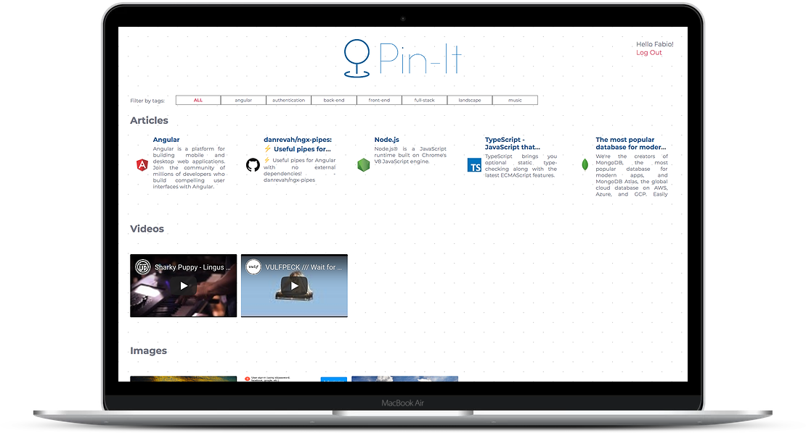

# Pin-it
Pin-it is a bookmark manager (browser / chrome extension) that will send you by email one bookmark a day as a digestible way to consume them!


## Screenshots




   

## Installation
To run the app please follow these instructions:

1. Clone the repository
```bash
git clone https://github.com/Videiraft/pin-it
cd pin-it
```
2. Install the dependencies

```bash
npm install
```
## Get it started
In the root project folder *pin-it*:
```bash
npm start
```
## Tech Stack
* Angular
* Typescript
* Node.js
* Express.js
* MongoDB
* Mongoose ODM

## Recommendation
Have a look at the server of this application: [Pin-it Server](https://github.com/Videiraft/pin-it-server)
Have a look at the chrome extension: [Chrome Extension](https://github.com/Videiraft/pin-it-chrome-ext)


## Developer
* Fábio Videira [LinkedIn](https://www.linkedin.com/in/fabio-videira/) | [GitHub](https://github.com/Videiraft)